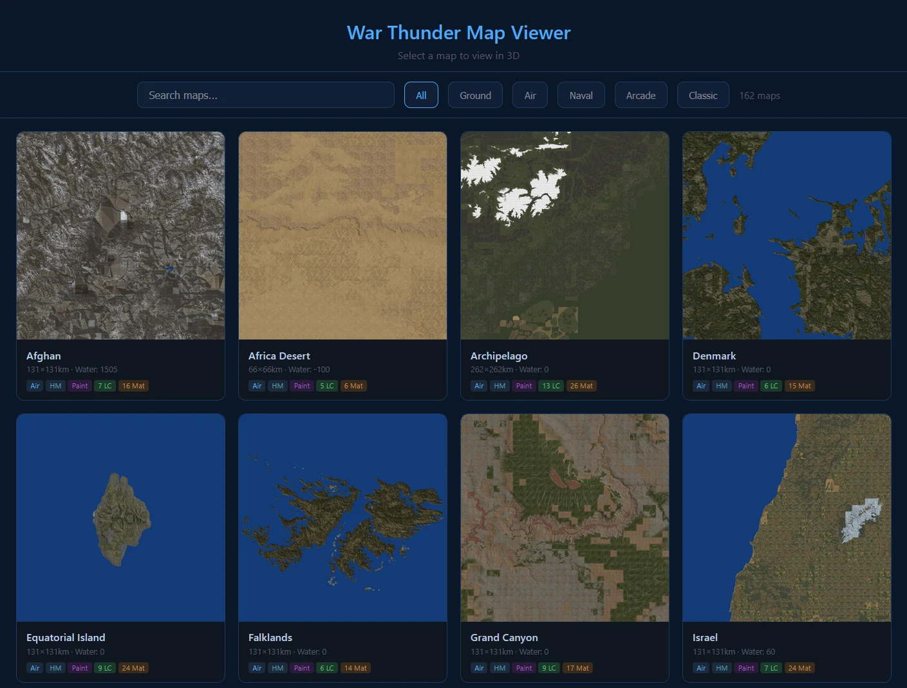
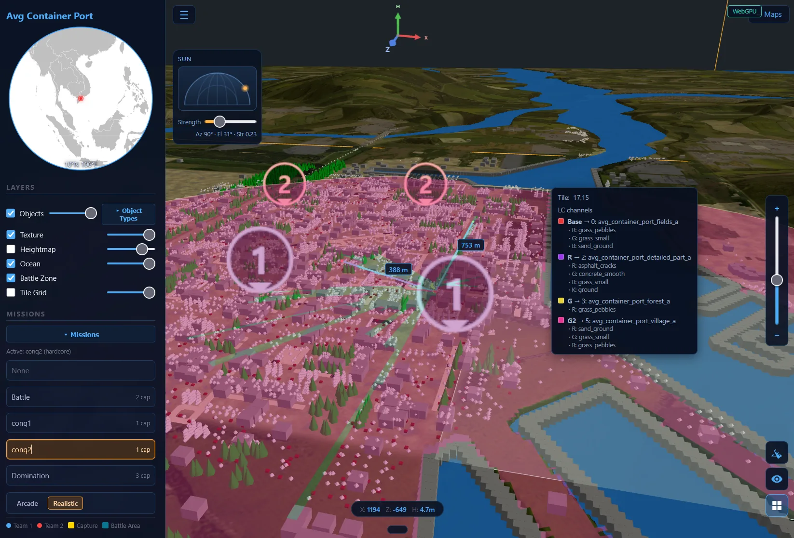

# WT-MapExtractor

War Thunder map data extractor and interactive 3D terrain viewer, written
in Rust.





## Features

- Native Rust extraction for DDSx, DxP, HM2, LandRayTracer, RIGz, BLK
  landclasses
- Native terrain-paint compositing (per-tile material-weight blend) with
  parallel Rayon workers
- Three.js 3D viewer with GPU vertex displacement, optional WebGPU
  line-of-sight, normal mapping, mission overlays, and Earth mini-globe
- Batch mode (`--all`) with per-map progress, ETA, and a thumbnail
  gallery (`src/index.html`)

## Pre-requirements

Set up `config.json` (see `config.sample.json`):

1. **Datamine path** — local clone of
   <https://github.com/gszabi99/War-Thunder-Datamine>
2. **Client path** — local War Thunder installation
3. **Oodle decompression** — handled natively via
   [`oozextract`](https://github.com/lvlvllvlvllvlvl/oozextract) (pure Rust
   port of ooz). No DLL required.

## Test Environment

- AMD Ryzen 7 5800X3D · 64 GB RAM · 9060XT 8 GB · Windows 11
- 162 maps total in current War Thunder version

## Performance vs. legacy Python implementation

| Metric | Python | Rust |
|--------|-------:|-----:|
| CPU usage | 50–99 % | 50–60 % |
| Peak RAM | 35+ GB | 20+ GB |
| Per map | 150–200 s | 20~50 s |
| All maps | ~4000 s | ~400 s |
| Output total | 25+ GB | 9+ GB |

## Quick start

```powershell
# build + serve all maps
cargo run --release -- --all

# build a single map
cargo run --release -- iwo_jima

# build several maps
cargo run --release -- iwo_jima guam

# open viewer without building
cargo run --release --

# tune worker count (default = min(CPU, 16); reduce on low-RAM machines)
$env:WT_WORKERS="8"; cargo run --release -- --all
```

### Useful flags

```powershell
# export per-material textures to mat/
cargo run --release -- iwo_jima --mat

# generate landclass thumbnails
cargo run --release -- iwo_jima --thumbs

# skip the local HTTP server (extract only)
cargo run --release -- iwo_jima --no-serve

# fast mode: skip tile-grid and rendinst stages
cargo run --release -- iwo_jima --fast
```

See `cargo run --release -- --help` for the full flag list.

## Required level files

Resolved automatically from the datamine path configured in
`config.json`. The minimum needed per map is `<map>.bin`; richer
metadata uses the optional files below.

| File | Required | Description |
|------|:--------:|-------------|
| `<map>.bin` | yes | DBLD container — DDSx textures, heightmap (HM2/LRT), landclass detail data |
| `<map>.blkx` | recommended | JSON metadata — coordinates, water level, grid dimensions |
| `<map>.dxp.bin` | optional | DxP2 texture pack — terrain material overlays |
| `hq_tex_<map>.dxp.bin` | optional | High-quality DxP2 texture pack |

Oodle decompression is built-in (`oozextract`). No external DLL needed.

## Pipeline

| Step | Description |
|------|-------------|
| 1 | Extract DDSx textures from `.bin` |
| 2 | Extract DxP material textures from `.dxp.bin` |
| 3 | Convert overview DDSx → colormap or normal map |
| 4 | Extract heightmap (HM2 → LandRayTracer mesh → pseudo fallback) |
| 5 | Export per-cell splatting tiles + material PNGs |
| 6 | Parse landclass detail BLK (per-landclass tiling, detail textures) |
| 7 | Composite painted terrain: weight maps × tiled materials |
| 8 | Optionally extract render-instances (`RIGz` → `rendinst.bin`) |

### Heightmap source priority

1. **HM2 block** — CompressedHeightmap (CBLOCK v2). High-resolution uint16.
2. **LandRayTracer mesh** — triangle mesh rasterised into a heightmap.
3. **Pseudo-heightmap** — Gaussian-blurred overview luminance fallback.

### Terrain painting

1. **Splatting tiles** (DXT1 128×128 per cell) encode RGBA weights mapped
   to landclass indices via `detTexIds`.
2. **Landclass definitions** parsed from Dagor BLK binary — base
   texture, detail textures (R/G/B/K), tiling sizes.
3. **Native weight blend** in Rust produces `terrain_paint.webp` by default
  (PNG when `--no-compress-map` is used).
4. **Parallel tile processing** uses Rayon to scale across cores.

### Batch mode (`--all`)

```
  ========== WT-MapExtractor: Batch Build All Maps ==========

  120 maps | 8 workers

  [ 15%] [18/120] avg_berlin    - 28.5s - OK   ETA: 364s
  [ 14%] [17/120] avg_normandy  - 24.3s - OK
  [ 13%] [16/120] avg_poland    - 31.2s - OK

  ===========================================================
  Build complete in 120.5s
  120 succeeded | 0 failed | 120 total
  ===========================================================
```

Failed maps display the full anyhow context for troubleshooting.

## 3D viewer

Open `src/viewer.html` (or omit `--no-serve`). Highlights:

- GPU vertex displacement + CPU raycast mesh for accurate hover read-out
- Height-scale slider (0–400 %)
- Real-time world-space coordinates + elevation in metres
- Layer toggles (texture, heightmap, ocean, battle zone, tile grid)
- DXT5nm normal maps auto-detected
- Earth mini-globe with the map location marked (Robinson projection,
  shipped locally as `src/World_Map.svg`, sourced from
  <https://commons.wikimedia.org/wiki/File:BlankMap-World.svg>)
- Mission overlay — spawn points, capture zones, battle areas
- Optional WebGPU line-of-sight (720 rays × 400 steps) with CPU fallback
- HM2 detail mesh on top of the base heightmap
- Floating live sun widget (azimuth/elevation dome + strength slider)
- Batch gallery (`src/index.html`) for `--all` builds

## Standalone in-game-map tool

A separate crate at `ingame_map/` renders a 2D tactical-map PNG from an
already-extracted `maps/<name>/` directory. It includes the grid, scale bar,
ocean mask, objects, and optional selected mission battle/capture/spawn
overlays. Outputs are saved under `ingame_map/` by default.

```powershell
cargo run --manifest-path ingame_map/Cargo.toml --release -- avg_vietnam_hills
```

For maps with missions, use `--list-missions` or render a specific mission:

```powershell
cargo run --manifest-path ingame_map/Cargo.toml --release -- avg_container_port --list-missions
cargo run --manifest-path ingame_map/Cargo.toml --release -- avg_container_port --mission 1
cargo run --manifest-path ingame_map/Cargo.toml --release -- avg_container_port --mission 0
cargo run --manifest-path ingame_map/Cargo.toml --release -- --all --type main
```

`--mission 0` is equivalent to `--no-mission`. In `--type battle`, this now keeps
the full map extent instead of forcing a battle-zone crop.

See `ingame_map/README.md` for full options.

## Project structure

```
src/
  main.rs             - CLI entrypoint
  cli.rs              - clap argument parser
  config.rs           - config.json loader
  pipeline.rs         - end-to-end extraction/export pipeline
  extract.rs          - DDSx + DxP extraction & decompression
  dxp_index.rs        - DxP material index
  export.rs           - overview / tile / material export
  heightmap.rs        - HM2 + LandRayTracer native heightmap
  landclass.rs        - Dagor BLK landclass parser
  paint.rs            - terrain paint compositing
  rendinst.rs         - RIGz render-instance extraction
  missions.rs         - mission BLK parser (spawns / zones)
  post.rs             - manifest + post-processing
  progress.rs         - batch progress / ETA rendering
  server.rs           - local static server for the viewer
  util.rs             - shared helpers
  viewer.html         - Three.js 3D viewer
config.json           - datamine + client paths (gitignored)
config.sample.json    - example configuration
maps/                 - output (default): per-map directories (gitignored)
docs/                 - technical documentation (formats, pipeline, issues)
ingame_map/           - standalone tactical-map renderer (gitignored)
```

## Supported texture formats

| Format | Description |
|--------|-------------|
| DXT1 (BC1) | Compressed, 4 bpp |
| DXT5 (BC3) | Compressed, 8 bpp |
| DXT5nm | Normal map (swizzled AG channels) — auto-detected |
| BC7 (DXGI 98) | Compressed, DX10 header — newer maps |
| A4R4G4B4 | Uncompressed, 16 bpp |
| A8R8G8B8 | Uncompressed 32-bit BGRA — B↔R swapped on read |

Compression containers handled: Oodle, zstd, zlib, lzma.

## Documentation

See [docs/README.md](docs/README.md) for an index of the technical
references (`BIN_FORMAT`, `BUILD_PIPELINE`, `PIPELINE_OVERVIEW`,
`HM2_REFERENCE`, `CDK_KNOWLEDGE`, `ORIENTATION`, `KNOWN_ISSUES`).
